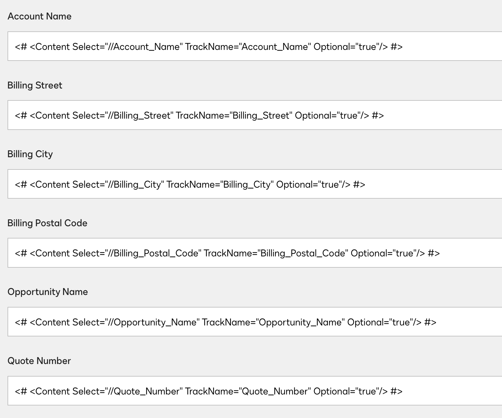

# DocuSign CLM Conditional Generator

A Chrome extension designed to streamline the creation of XPath conditional statements for DocuSign CLM document templates. This tool simplifies the process of generating and applying conditional logic within DocuSign CLM's form configuration interface.



## Features

- 🔍 Dynamic field extraction from DocuSign CLM forms
- 📝 Intuitive interface for building conditional statements
- 🔄 Local caching system for improved performance
- 📤 XML/TXT file upload support for custom field population
- 🔧 Advanced field extraction with retry mechanisms
- 💾 Cache management functionality
- 🔢 Support for comma-separated numeric values

## Installation

1. Clone this repository or download the source code
2. Open Chrome and navigate to `chrome://extensions/`
3. Enable "Developer mode" in the top right corner
4. Click "Load unpacked" and select the extension directory
5. The extension icon should appear in your Chrome toolbar

## Usage

1. Navigate to your DocuSign CLM form configuration page
2. Click the extension icon in your Chrome toolbar
3. Select fields from the dropdown menu
4. Choose an operator
5. Enter your desired value
6. Generate and apply your conditional statement

### Custom XML Upload
- Use the file upload feature to load custom XML or TXT files
- Field names will automatically populate the dropdown
- Node values will be inserted into the value field

## Technical Details

### Architecture
- **Manifest Version**: 3
- **Content Script**: Handles page interaction and field extraction
- **Popup Script**: Manages UI and user interactions
- **Storage**: Utilizes Chrome's storage API for caching

### Permissions
- `activeTab`: For page interaction
- `scripting`: For dynamic script execution
- `storage`: For local data caching

### Compatibility
- Designed for DocuSign CLM (springcm.com)
- Chrome browser support
- UAT environment support

## Development

### Project Structure
```
├── content.js          # Page interaction logic
├── manifest.json       # Extension configuration
├── popup.html         # UI template
├── popup.js           # UI logic
├── styles.css         # Styling
├── docs/
│   ├── blueprint.md   # Project documentation
│   ├── img/          # Images and assets
│   └── code/         # Version history
└── icons/            # Extension icons
```

### Version Control
- All code changes are versioned in `docs/code/versions/`
- Format: `DD-MM-YYYY-HH-mm`
- Enables easy rollback and change tracking

## Future Enhancements

- Field name simplification (node name extraction)
- Enhanced caching mechanisms
- Performance optimizations
- Extended numeric operation support
- Advanced error handling

## Contributing

1. Fork the repository
2. Create a feature branch
3. Commit your changes
4. Push to the branch
5. Create a Pull Request

## License

This project is proprietary software. All rights reserved.
